<!-- The sections below are pictures of docs/report/index.html (the full page with playable videos),
     rendered by tools/docs/render_readme.py so the README keeps its look on GitHub. -->

<a href="docs/report/media/"><picture><source media="(prefers-color-scheme: dark)" srcset="docs/readme/00-hero-dark.webp">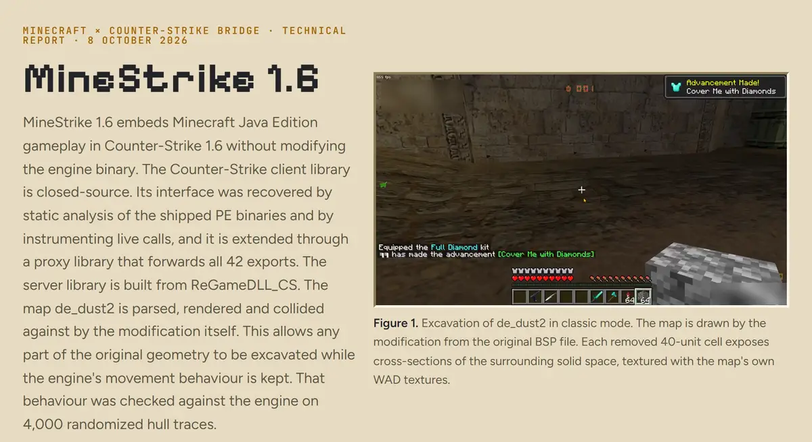</picture></a>

<picture><source media="(prefers-color-scheme: dark)" srcset="docs/readme/01-facts-dark.png">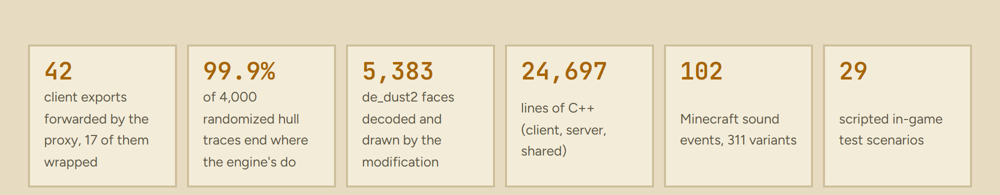</picture>

<a href="docs/report/media/"><picture><source media="(prefers-color-scheme: dark)" srcset="docs/readme/02-flight-dark.webp">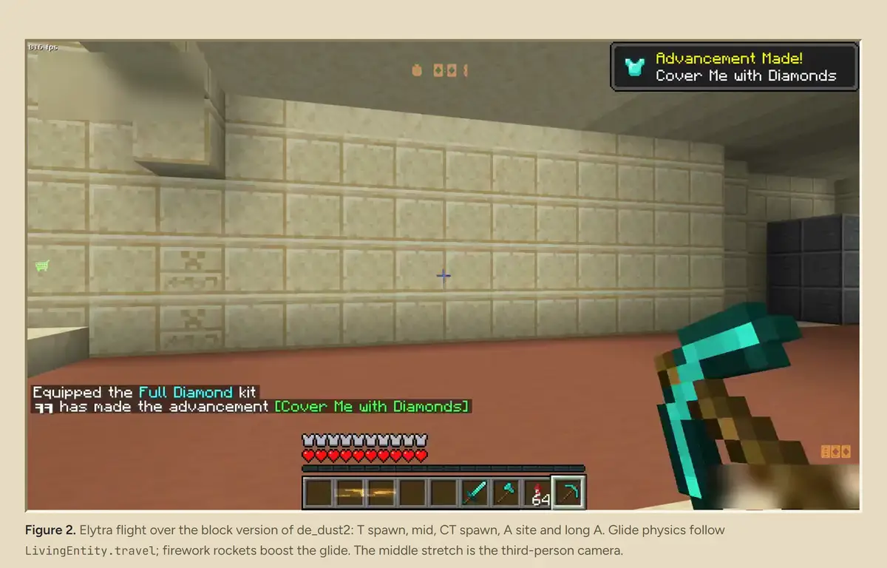</picture></a>

<picture><source media="(prefers-color-scheme: dark)" srcset="docs/readme/03-re-dark.png">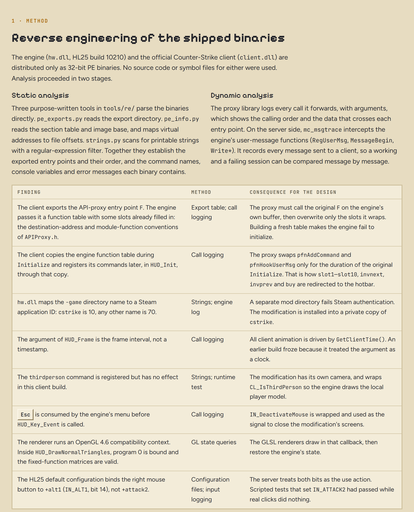</picture>

<picture><source media="(prefers-color-scheme: dark)" srcset="docs/readme/04-server-dark.png">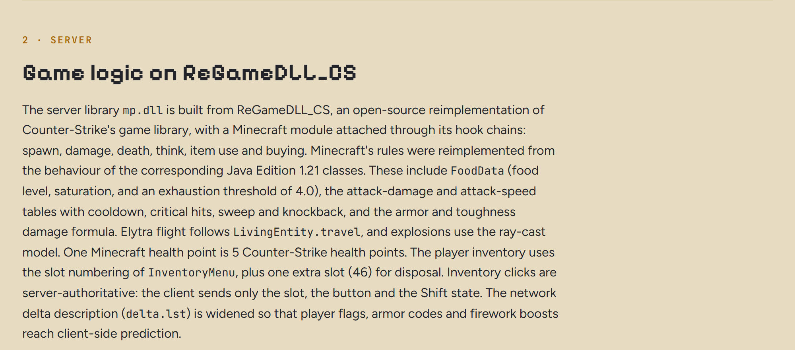</picture>

<picture><source media="(prefers-color-scheme: dark)" srcset="docs/readme/05-classic-dark.jpg">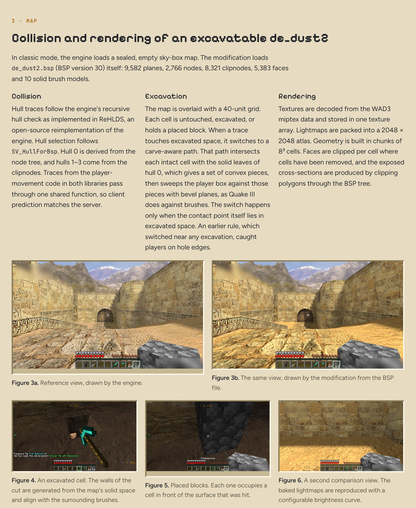</picture>

<picture><source media="(prefers-color-scheme: dark)" srcset="docs/readme/06-survival-dark.jpg">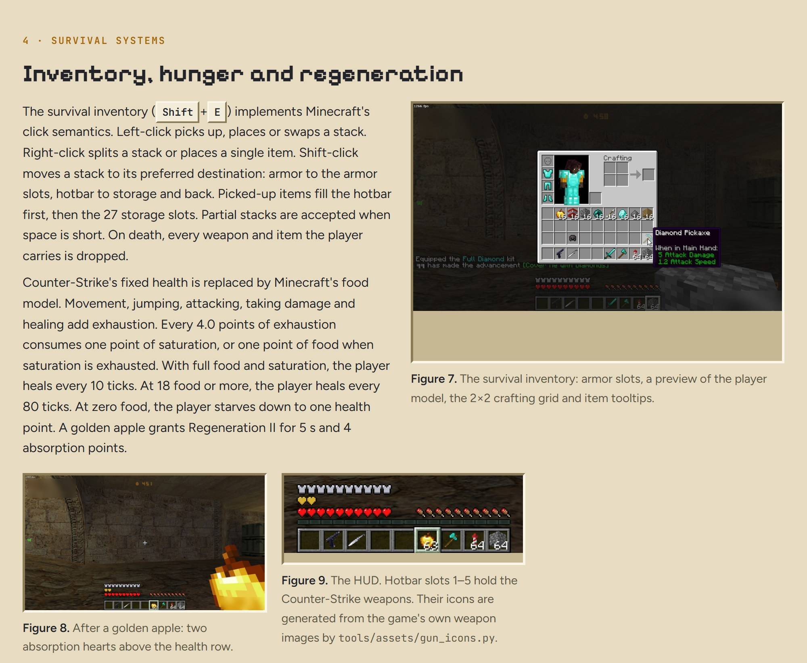</picture>

<picture><source media="(prefers-color-scheme: dark)" srcset="docs/readme/07-combat-dark.jpg">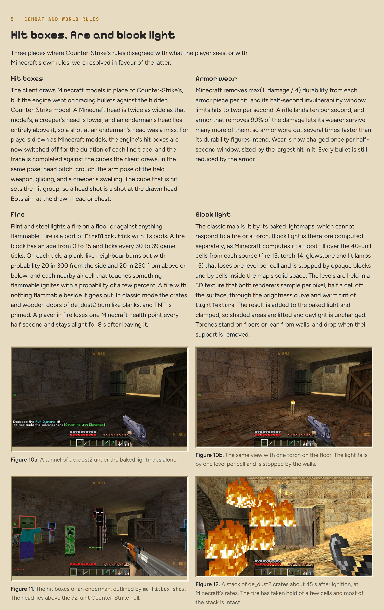</picture>

<picture><source media="(prefers-color-scheme: dark)" srcset="docs/readme/08-play-dark.png"></picture>

<a href="docs/report/media/"><picture><source media="(prefers-color-scheme: dark)" srcset="docs/readme/09-clips-dark.jpg">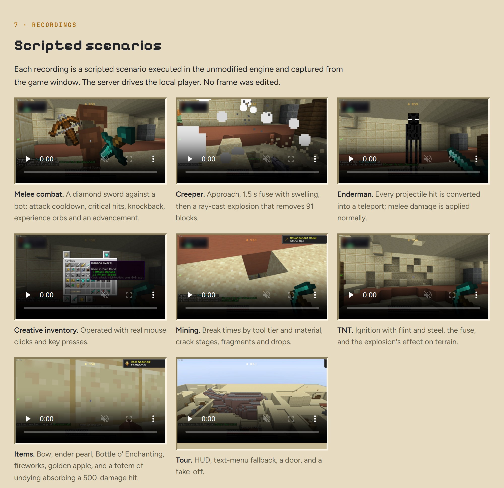</picture></a>

<picture><source media="(prefers-color-scheme: dark)" srcset="docs/readme/10-stills-dark.jpg"></picture>

<picture><source media="(prefers-color-scheme: dark)" srcset="docs/readme/11-how-dark.png">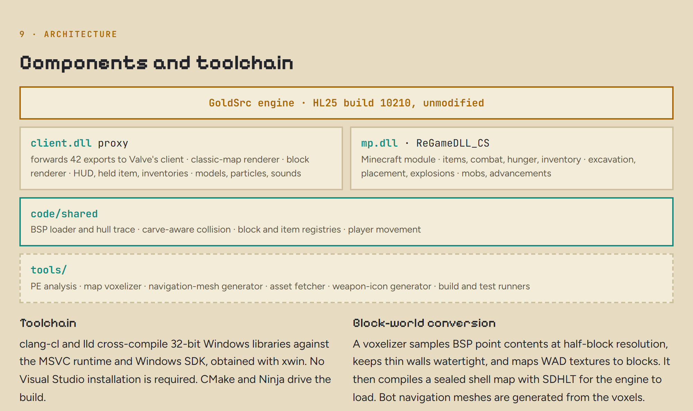</picture>

<picture><source media="(prefers-color-scheme: dark)" srcset="docs/readme/12-verification-dark.png">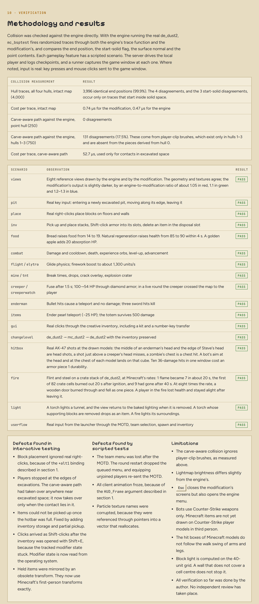</picture>

<picture><source media="(prefers-color-scheme: dark)" srcset="docs/readme/13-next-dark.png">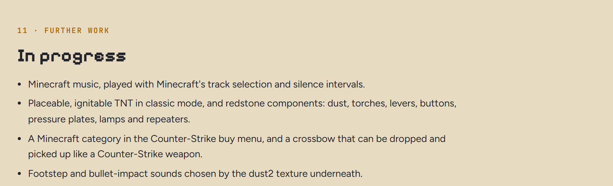</picture>

<picture><source media="(prefers-color-scheme: dark)" srcset="docs/readme/14-footer-dark.png">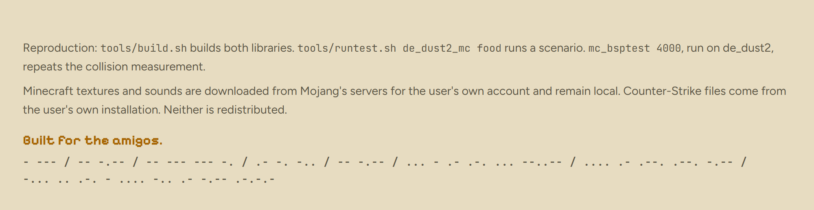</picture>

---

## What is in it since the first release

- **Blocks are an economy.** A block costs by what it stops: wool, glass and sand ($50) stop no bullet, planks ($100) stop pistols but not rifles, stone ($200) stops every gun, obsidian ($800) stops TNT too. Rounds are short, so a wall buys seconds that matter.
- **Bots that build and breach.** They wall a way in and wait behind it or leave it as a bluff, dig through with cover, blow thin site walls open, lay mines, bridge craters. Nothing is on a cue: each use is a bot weighing its moment, and they learn the way in you take and what you do at a wall.
- **The iron golem.** Four iron blocks in a T and a carved pumpkin: it fights for your side and plays the objective. Bullets only slow it, and one in ten comes back at whoever fired it; only a sword hurts it.
- **The wither.** Four soul sand and three wither skeleton skulls, all the money a player can hold. It rises for eleven seconds, goes off with a blast the whole map hears, and hunts the other side with exploding skulls.
- **The round's story.** When a round ends everybody gets one line on how it was won and what was done with blocks, TNT and mobs.

Everything is described in [docs/MANUAL.md](docs/MANUAL.md).

## Getting it running

MineStrike 1.6 is a mod for your own copy of Counter-Strike 1.6. It ships no Valve or Mojang files: everything derived from them is made on your machine from your own copies.

**You need** Windows, **Counter-Strike 1.6 installed in Steam**, and you should own **Minecraft: Java Edition** (its textures and sounds are fetched from Mojang's servers for your own use).

1. Download this repository (the green **Code** button, then **Download ZIP**) and unpack it anywhere.
2. Double-click **`INSTALL.bat`**.
3. When it says *Done*, double-click **`PLAY_MineStrike_dust2.bat`**.

The installer works in that folder only and leaves your Steam game as it is. It copies your Half-Life folder there, fetches what it needs (Minecraft's textures and the sounds the mod plays, a Python it keeps to itself, the SDHLT map compiler, the mod's two libraries from this project's [releases](https://github.com/zhadyz/minestrike-1.6/releases)), makes the block version of de_dust2 from your own map, and has the bots work out de_dust2 once on a server without a window. Allow five to ten minutes and about 2 GB of disk. Run it again at any time: what is done already is skipped.

- If it does not find Counter-Strike: `INSTALL.bat -HalfLife "D:\SteamLibrary\steamapps\common\Half-Life"`.
- This copy of the game is for playing offline with bots (it runs in insecure LAN mode). Do not connect it to online servers.
- Controls and settings are in [docs/MANUAL.md](docs/MANUAL.md).

### Building the libraries yourself

Only if you want to change the code. The two libraries are 32-bit Windows DLLs built with clang-cl and lld (CMake and Ninja, the MSVC runtime and Windows SDK from xwin; no Visual Studio).

1. [ReGameDLL_CS](https://github.com/rehlds/ReGameDLL_CS) at commit `4a50c42e85fd3778c2b7d24731c7d30c83bbab01` into `src/ReGameDLL_CS`, then `python tools/build/patch_regamedll.py` (it inserts the mod's hooks, each marked `// [csmc]`).
2. The [Half-Life SDK](https://github.com/ValveSoftware/halflife) into `src/halflife`.
3. Configure `code/client` and `code/server` with `tools/clang-cl-x86.cmake` and build. `tools/build.sh` does this, but it still assumes the checkout lies at `Z:\dev\CSminecraft`.
4. `INSTALL.bat -Bin <folder with your client.dll and mp.dll>` installs them like the released ones.

## Licence

GPL-3.0 (see [LICENSE](LICENSE)). The server library is built from [ReGameDLL_CS](https://github.com/rehlds/ReGameDLL_CS), which is GPL-3.0. Minecraft is a trademark of Mojang; Counter-Strike and Half-Life are trademarks of Valve. This project is not affiliated with either, and neither company's assets are included.

Built for the amigos.

\- --- / -- -.-- / -- --- --- -. / .- -. -.. / -- -.-- / ... - .- .-. ... --..-- / .... .- .--. .--. -.-- / -... .. .-. - .... -.. .- -.-- .-.-.-
