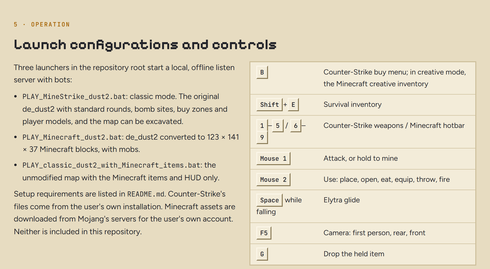
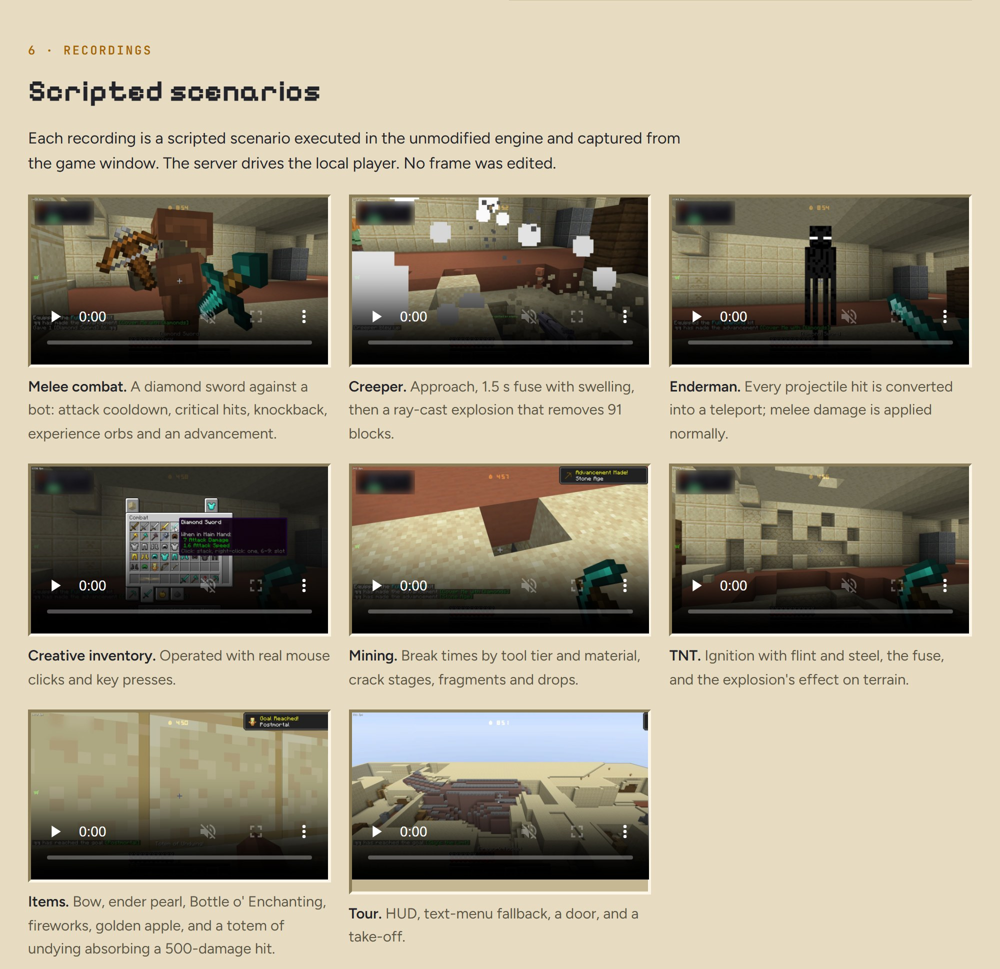
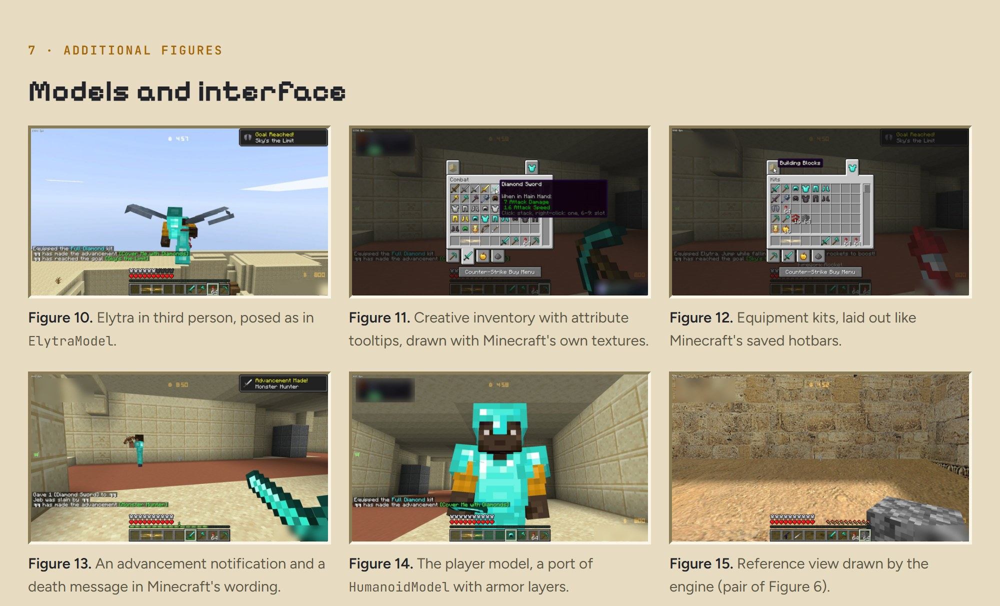
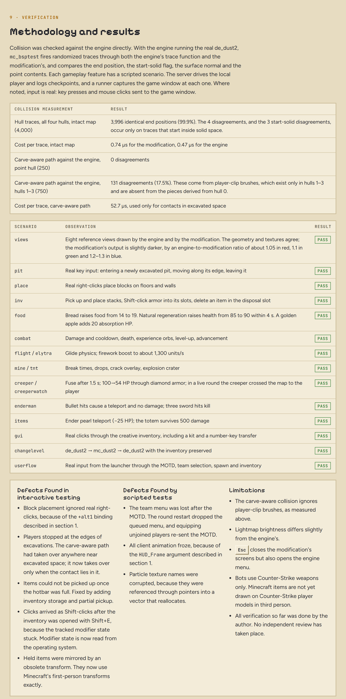

<!-- The sections below are pictures of docs/report/index.html (the full page with playable videos),
     rendered by tools/docs/render_readme.py so the README keeps its look on GitHub. -->

<a href="docs/report/media/"><picture><source media="(prefers-color-scheme: dark)" srcset="docs/readme/00-hero-dark.webp"></picture></a>

<picture><source media="(prefers-color-scheme: dark)" srcset="docs/readme/01-facts-dark.png"></picture>

<a href="docs/report/media/"><picture><source media="(prefers-color-scheme: dark)" srcset="docs/readme/02-flight-dark.webp"></picture></a>

<picture><source media="(prefers-color-scheme: dark)" srcset="docs/readme/03-re-dark.png"></picture>

<picture><source media="(prefers-color-scheme: dark)" srcset="docs/readme/04-server-dark.png"></picture>

<picture><source media="(prefers-color-scheme: dark)" srcset="docs/readme/05-classic-dark.jpg"></picture>

<picture><source media="(prefers-color-scheme: dark)" srcset="docs/readme/06-survival-dark.jpg"></picture>

<picture><source media="(prefers-color-scheme: dark)" srcset="docs/readme/07-play-dark.png"></picture>

<a href="docs/report/media/"><picture><source media="(prefers-color-scheme: dark)" srcset="docs/readme/08-clips-dark.jpg"></picture></a>

<picture><source media="(prefers-color-scheme: dark)" srcset="docs/readme/09-stills-dark.jpg"></picture>

<picture><source media="(prefers-color-scheme: dark)" srcset="docs/readme/10-how-dark.png"></picture>

<picture><source media="(prefers-color-scheme: dark)" srcset="docs/readme/11-verification-dark.png"></picture>

<picture><source media="(prefers-color-scheme: dark)" srcset="docs/readme/12-next-dark.png"></picture>

<picture><source media="(prefers-color-scheme: dark)" srcset="docs/readme/13-footer-dark.png"></picture>

---

## Getting it running

MineStrike 1.6 is a mod for your own copy of Counter-Strike 1.6. It ships no Valve or Mojang files: everything derived from them is created on your machine from your own copies.

1. **Counter-Strike 1.6** (Steam, HL25 build): copy your `Half-Life` folder to `game/Half-Life`, a private copy for the mod.
2. **Minecraft Java Edition**, owned by you: `tools/assets/fetch_mc_assets.py` and `tools/assets/fetch_music.py` download the textures, sounds and music from Mojang's servers for local use only.
3. **ReGameDLL_CS** source in `src/ReGameDLL_CS`; the server library is built from it.
4. **Toolchain**: clang-cl, lld, CMake and Ninja, with the MSVC runtime and Windows SDK from xwin. No Visual Studio is needed.
5. **Maps**: `tools/voxelizer` converts your `de_dust2.bsp` into the block world and the shell map. It uses [SDHLT v1.3.0](https://github.com/seedee/SDHLT/releases), unpacked into `tools/sdhlt/v130`.
6. **Game files**: `python tools/setup/gen_gamedata.py game/Half-Life/cstrike` makes the files based on Counter-Strike's own (the classic-mode map shell, its bot navigation and overview, `delta.lst`, `listenserver.cfg`).
7. `tools/build.sh` builds both libraries and deploys them with the files in `gamedata/`.

Then run `PLAY_MineStrike_dust2.bat`. Controls, settings and testing are in [docs/MANUAL.md](docs/MANUAL.md). The scripts still assume the checkout lives at `Z:\dev\CSminecraft`; making them location-independent is open work.

## Licence

GPL-3.0 (see [LICENSE](LICENSE)). The server library is built from [ReGameDLL_CS](https://github.com/rehlds/ReGameDLL_CS), which is GPL-3.0. Minecraft is a trademark of Mojang; Counter-Strike and Half-Life are trademarks of Valve. This project is not affiliated with either, and neither company's assets are included.

Built for the amigos.

\- --- / -- -.-- / -- --- --- -. / .- -. -.. / -- -.-- / ... - .- .-. ... --..-- / .... .- .--. .--. -.-- / -... .. .-. - .... -.. .- -.-- .-.-.-
